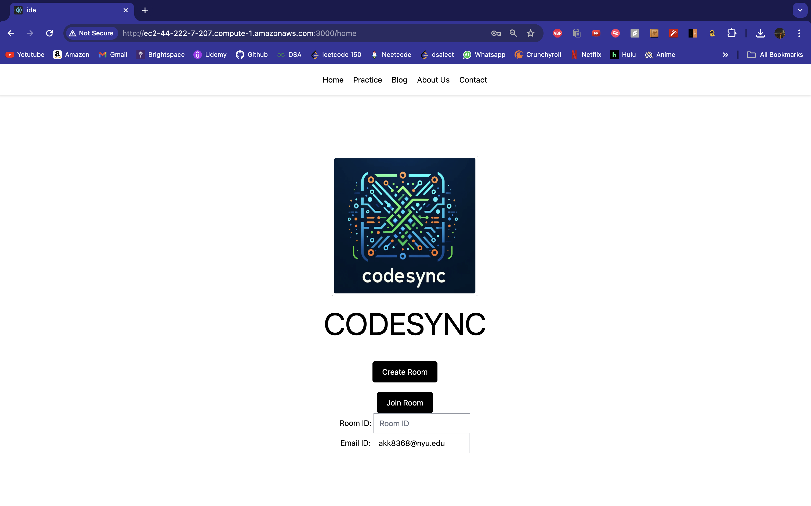

# CodeSync ✨

CodeSync is a cloud-based Integrated Development Environment (IDE) designed to revolutionize the technical interview process by enabling real-time collaborative coding sessions. Leveraging a suite of AWS services, CodeSync provides a secure, scalable, and highly responsive platform that facilitates dynamic interactions between interviewers and candidates.

## Table of Contents 📑

- [Introduction](#introduction)
- [Features](#features)
- [Architecture](#architecture)
- [Technologies Used](#technologies-used)
- [Installation](#installation)
- [Usage](#usage)
- [Screenshots](#screenshots)
- [Challenges](#challenges)
- [Future Work](#future-work)
- [Contributing](#contributing)
- [License](#license)
- [Authors](#authors)

## Introduction 📝

CodeSync addresses the limitations of traditional technical interviews by providing a platform where real-time collaboration and problem-solving skills can be assessed accurately. This cloud-based IDE supports interactive coding sessions within a robust and user-friendly interface, helping companies make more informed hiring decisions.

## Features 🌟

- **Real-Time Collaboration**: Enables multiple users to code together in real-time, with synchronized code editors.
- **User Authentication**: Secure sign-up, sign-in, and access control using Amazon Cognito.
- **Serverless Computing**: Efficient backend processing with AWS Lambda.
- **Data Storage**: Reliable data storage and retrieval using Amazon DynamoDB and S3.
- **Web Hosting**: Hosted with AWS Amplify and scalable container management using Amazon EC2.
- **Code Execution**: Runs user-submitted Python code in isolated Docker containers.
- **WebSockets**: Facilitates real-time updates and interactions.

## Architecture 🏗️

The architecture of CodeSync leverages various AWS services to create a robust, secure, and scalable platform. Here’s an overview of how the project works:

### User Authentication 🔐

- **Amazon Cognito** manages user authentication and authorization, ensuring that only authenticated users can access their coding sessions and personal data.

### Backend Processing 🖥️

- **AWS Lambda** functions handle business logic, such as user and session management, data retrieval, and code execution requests. Lambda allows for serverless computing, reducing the need for physical server management.
- **Amazon API Gateway** routes incoming API requests to the appropriate Lambda functions, providing a scalable and secure API management solution.

### Data Storage 💾

- **Amazon DynamoDB** is used for storing user and room data efficiently. DynamoDB offers quick data retrieval and scalability, crucial for maintaining smooth operation during peak loads.
- **Amazon S3** stores and retrieves user-generated content and session data, providing durable, highly available object storage.

### Real-Time Communication 🔄

- **WebSockets** enable real-time communication and synchronization among users. This integration involves several AWS Lambda functions that manage user connections, broadcast code changes, execute code, and share results.

### Code Execution 🚀

- **Docker Containers** execute user-submitted Python code within isolated environments. Each code execution occurs in a standalone Docker container, ensuring isolation and preventing any potential interference between different users' processes.
- **Amazon EC2** manages Docker containers, ensuring efficient container orchestration, allowing for scaling and management of application deployment.

### Additional AWS Services ☁️

- **Amazon SQS** manages message queuing for decoupling internal services and reliably transmitting event data between different components.

### Architecture Diagram 🖼️


## Technologies Used 🛠️

- **Frontend**: React, Vite
- **Backend**: Node.js, Express.js
- **Real-Time Communication**: WebSockets
- **Authentication**: Amazon Cognito
- **Serverless Computing**: AWS Lambda
- **API Management**: Amazon API Gateway
- **Data Storage**: Amazon DynamoDB, Amazon S3
- **Message Queuing**: Amazon SQS
- **Container Management**: Amazon EC2
- **Containerization**: Docker

## Installation ⚙️

### Prerequisites 📋

- Node.js
- npm or yarn
- AWS account with necessary permissions

### Backend Setup 🔧

1. Clone the repository:
    ```bash
    git clone https://github.com/AdityaOjhalang/CodeSync.git
    cd CodeSync
    ```

2. Install dependencies:
    ```bash
    npm install
    ```

3. Set up AWS services and environment variables as required in `config.js`.

4. Start the backend server:
    ```bash
    npm start
    ```

### Frontend Setup 🎨

1. Navigate to the frontend directory:
    ```bash
    cd frontend
    ```

2. Install dependencies:
    ```bash
    npm install
    ```

3. Start the React application:
    ```bash
    npm start
    ```

## Usage 🚀

1. Open your browser and navigate to `http://localhost:3000`.
2. Sign up or sign in using your credentials.
3. Create or join a coding room using a unique `roomId`.
4. Start coding collaboratively in real-time.

## Screenshots 📸

### Sign-Up Page 🔑


### Sign-In Page 🔑


### Home Page 🏠



### Code Editor 💻


## Challenges 🧗‍♂️

During the development of CodeSync, several challenges were encountered and addressed:

- **WebSockets Integration**: Ensuring data consistency and timely delivery across multiple client sessions.
- **Secure Code Execution**: Using Docker containers to run code securely and in isolation.
- **Real-Time Output Synchronization**: Synchronizing code output for all participants using WebSockets and AWS S3.
- **Scalable Deployment**: Automating deployment processes with AWS Amplify for efficient load management.

## Future Work 🔮

- **Advanced Code Analysis Tools**: Real-time feedback on code quality and efficiency.
- **Expanded Language Support**: Support for additional programming languages.
- **Mobile Compatibility**: Developing a mobile-friendly version of the platform.
- **AI-Driven Insights**: Analyzing coding patterns to suggest improvements.
- **Global Scaling**: Optimizing infrastructure for global performance with potential integration of global CDN solutions.

## Contributing 🤝

We welcome contributions to CodeSync! Please follow these steps:

1. Fork the repository.
2. Create a new branch for your feature or bug fix.
    ```bash
    git checkout -b feature/your-feature
    ```
3. Commit your changes:
    ```bash
    git commit -m "Add your feature"
    ```
4. Push to the branch:
    ```bash
    git push origin feature/your-feature
    ```
5. Open a pull request.

### Demo Video 📹

Watch the demo of CodeSync on [YouTube](https://youtu.be/BAWfW_pt2eU)! 🎥

## Authors 👥

- Aditya Ojha - [ao2612@nyu.edu](mailto:ao2612@nyu.edu)
- Suprateek Chatterjee - [sc10344@nyu.edu](mailto:sc10344@nyu.edu)
- Karmanya Mendiratta - [km6296@nyu.edu](mailto:km6296@nyu.edu)
- Ananya Kumar Gangver - [akk8368@nyu.edu](mailto:akk8368@nyu.edu)

